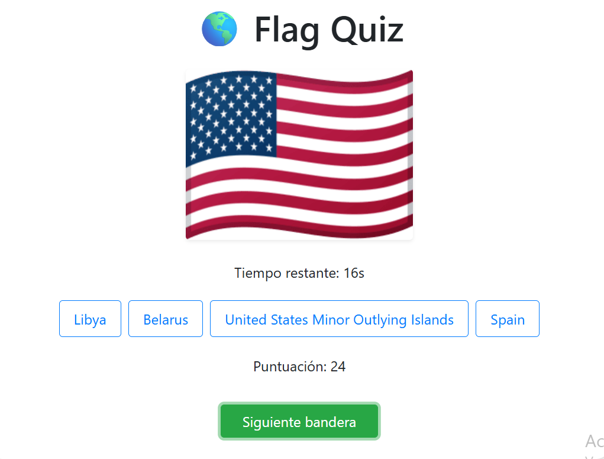

# 🌎 Flag Quiz


_Imagen de ejemplo; reemplázala con la captura de tu aplicación._

**Flag Quiz** es un juego interactivo de React donde los usuarios deben adivinar el país correspondiente a la bandera mostrada. Cada pregunta tiene un límite de 20 segundos y el puntaje depende del tiempo restante. Respuestas incorrectas restan puntos y deshabilitan la opción seleccionada.

---

## ⚡ Tecnologías usadas

- **React 18** con **Vite**
- **JavaScript / JSX**
- **Bootstrap 5** para estilos y componentes
- **world-countries** para obtener la lista de países y sus códigos ISO
- **CSS personalizado** para mejorar la apariencia

---

## 🚀 Instalación y ejecución local

1. **Clonar el repositorio:**

```bash
git clone https://github.com/tu-usuario/flag-quiz.git
cd flag-quiz
```
